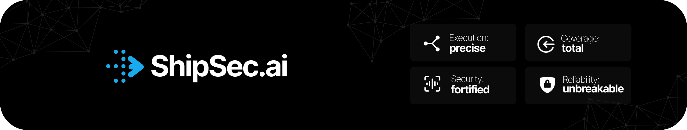
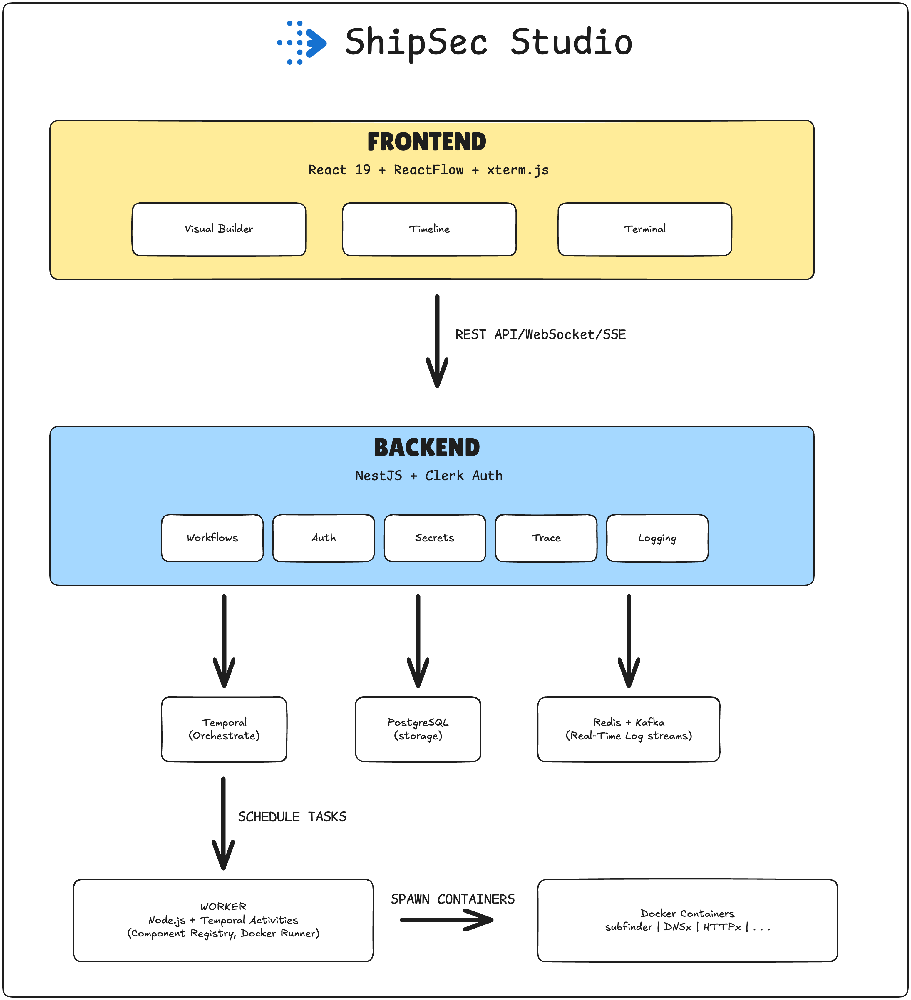

<div align="center">
  
</div>

<p align="center">
  
  <a href="https://github.com/ShipSecAI/studio/tree/main/LICENSE"></a>
  <a href="https://shipsec.ai"></a>
  
  
  
</p>
<p align="center">
  <a href="https://discord.gg/fmMA4BtNXC"></a>
  <a href="https://github.com/ShipSecAI/studio/discussions"></a>
  <a href="https://twitter.com/shipsecai"></a>
</p>


# ShipSec Studio

The no-code security automation studio for security teams. Design reliable and reusable security workflows.

ShipSec Studio is a security workflow orchestration platform that combines the power of visual programming with enterprise-grade reliability. Unlike traditional automation tools that require complex scripting, ShipSec Studio lets you build security workflows through an intuitive canvas while maintaining the robustness your team needs.

## Demo

<demo here>

## Why ShipSec Studio?

🎨 **Visual Workflow Builder** : Design security automations with drag-and-drop, no coding required

⚡ **Real-Time Execution** : Watch workflows run live with streaming logs and progress indicators

🧩 **Pre-Built Security Components** : Subfinder, DNSX, HTTPx, Nuclei, and more ready to use

🔒 **Enterprise Reliability** : Built on Temporal for durable, resumable workflow executions

🛡️ **Secure by Default** : Encrypted secrets, role-based access, and audit trails

💻 **Run Anywhere** : Cloud hosted or self-hosted on your own infrastructure

## Quick Start

Get started with ShipSec Studio in minutes:

### Option 1: Use the Hosted Platform

1. **Sign up** at [studio.shipsec.ai](https://studio.shipsec.ai)
2. **Create your first workflow** using the visual builder
3. **Run a scan** with pre-built components like Subfinder, Nuclei, or HTTPx
4. **View results** in real-time as the workflow executes

### Option 2: Run Locally

#### Prerequisites

- **[bun.sh](https://bun.sh)** - Fast JavaScript runtime and package manager
- **[docker](https://www.docker.com/)** - For running security components in isolated containers
- **[just](https://github.com/casey/just)** - Command runner for simplified development workflows

#### Quick Setup with `just` (Recommended)

```bash
# Clone the repository
git clone https://github.com/ShipSecAI/studio.git
cd studio

# Initialize (installs dependencies and creates environment files)
just init

# Start development environment
just dev

# Visit http://localhost:5173 to access ShipSec Studio
```

### Your First Workflow

1. **Open the Workflow Builder** from the dashboard
2. **Add a Manual Trigger node** for manual execution
3. **Add a Subfinder node** for subdomain discovery
4. **Run the workflow** and watch real-time execution

🎉 **Congratulations!** You've just run your first security workflow in ShipSec Studio.

## 🔎 System Architecture

<div align="center">
  
</div>

## 🔥 Latest Updates

- Dec 11, 2025 - **Execution Canvas Improvements** - Enhanced drag-and-drop experience
- Dec 10, 2025 - **Modernized Documentation** - Updated terminology and cleaner structure
- Dec 9, 2025 - **Backend Version Check** - Automatic compatibility verification on startup
- Dec 8, 2025 - **Workflow Scheduling** - Schedule workflows to run at specific times or intervals


## Documentation

📚 **Complete documentation** is available at **[docs.shipsec.ai](https://docs.shipsec.ai)**

- Getting Started Guides
- Component Development
- API Reference
- Architecture Overview
- And much more...

## Community

Join the ShipSec community to get help, share ideas, and stay updated:

- 💬 **[Discord](https://discord.gg/fmMA4BtNXC)** — Chat with the team and community
- 🗣️ **[Discussions](https://github.com/ShipSecAI/studio/discussions)** — Ask questions and share ideas
- 🐛 **[Issues](https://github.com/ShipSecAI/studio/issues)** — Report bugs or request features
- 🐦 **[Twitter](https://twitter.com/shipsecai)** — Follow for updates and announcements

## Contributing

We welcome contributions! Please follow these steps:

1. Fork the repository
2. Create a feature branch (`git checkout -b feature/amazing-feature`)
3. Make your changes
4. Run tests and quality checks:
   ```bash
   bun run test
   bun run lint
   bun run typecheck
   ```
5. Commit your changes using [Conventional Commits](https://conventionalcommits.org/)
6. Push to the branch (`git push origin feature/amazing-feature`)
7. Open a Pull Request

### Development Guidelines

- Follow Conventional Commit subjects (`feat:`, `fix:`, `docs:`) and reference issues/milestones in PRs
- Keep workflow IDs in the `shipsec-run-*` shape
- Reuse shared schemas instead of creating bespoke types
- For new components, add tests and update documentation
- Document manual validation (Temporal run IDs, Loki queries) in PR descriptions

Bring your own creativity. ShipSec Studio is built to be extended.

## License

ShipSec Studio is licensed under the [Apache License 2.0](LICENSE).

<div align="center">
  <p>Built with ❤️ by the ShipSec AI team</p>
</div>
