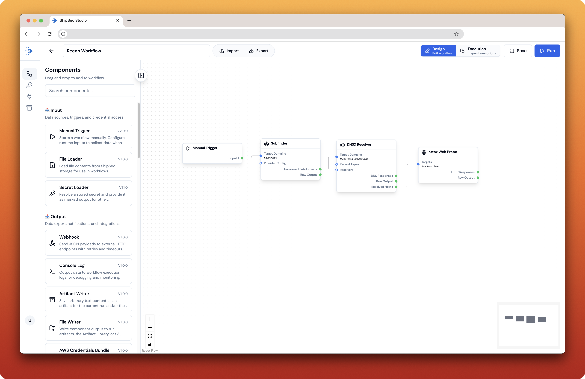
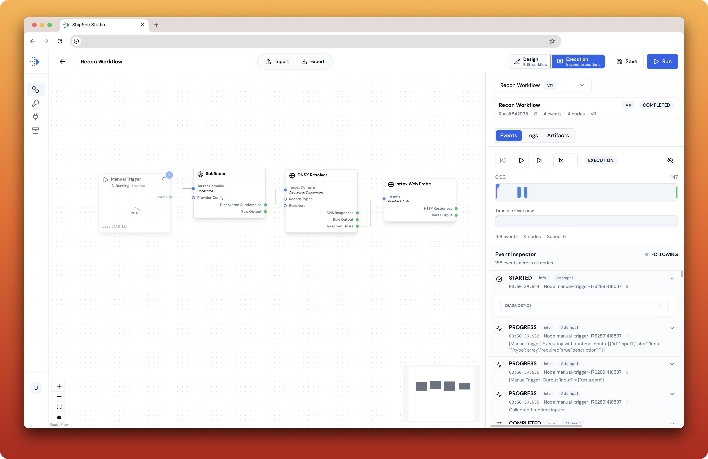
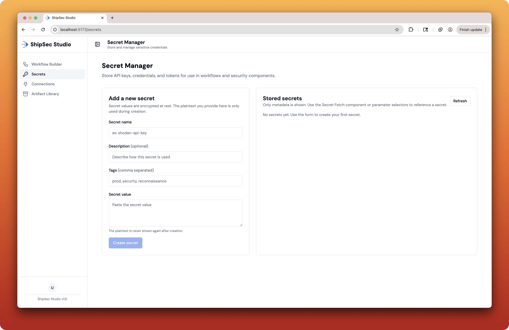
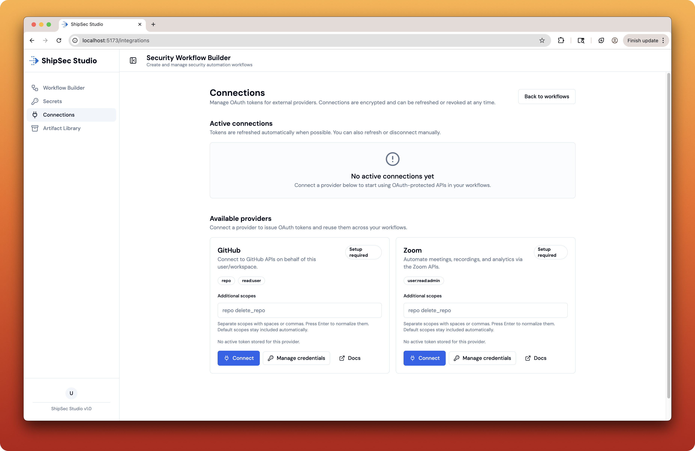
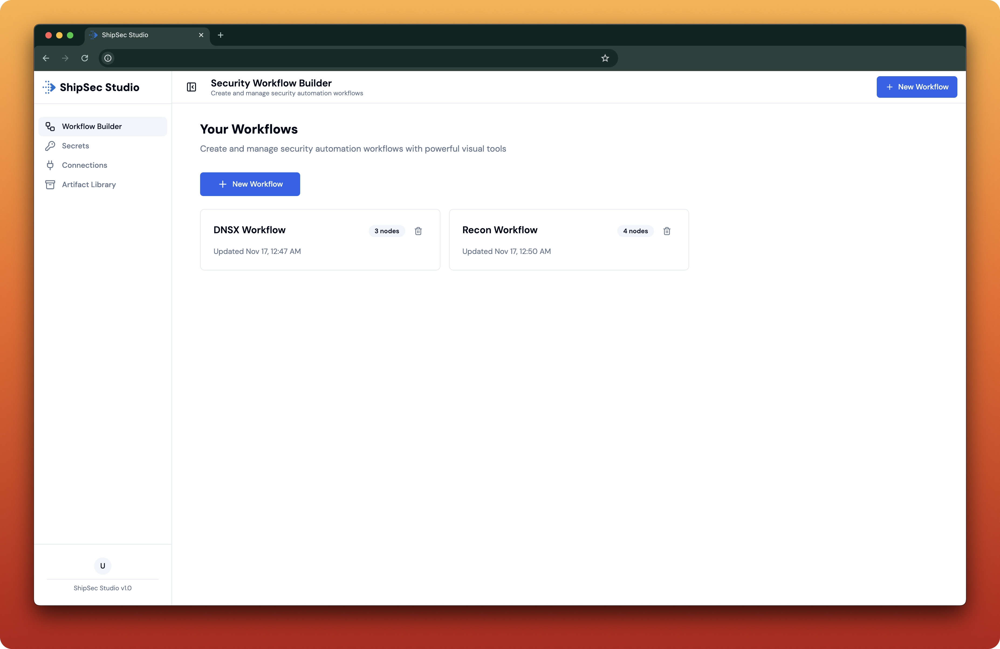

# ShipSec Studio

> The execution studio for security teams. Design reusable reconnaissance workflows, see every run unfold live, and keep humans in the loop with opinionated guardrails.

ShipSec Studio bundles everything you need to design security workflows: a visual builder for automation graphs, a typed API for orchestration, and a worker tier that executes components inside guarded containers.

---

## Product Tour

| Workflow Builder | Live Execution Timeline | Secrets & Integrations |
| --- | --- | --- |
|  |  |  |

| Connections Catalog | Org Dashboard |
| --- | --- |
|  |  |

> 📸 Gallery assets live under `docs/media/`. Replace the existing `workflow-sample.png`, `workflow-execution.png`, `secret-manager.png`, `connections-screen.png`, or `dashboard.png` files to refresh the screenshots without editing the README.

---

## Table of Contents

- [Why ShipSec Studio?](#why-shipsec-studio)
- [Quick Start](#quick-start)
- [Documentation](#documentation)
- [Contributing & Support](#contributing--support)
- [License](#license)

---

## Why ShipSec Studio?

- **Component-driven orchestration** – Drag-and-drop vetted discovery, DNS, HTTP, and enrichment components or wire in custom activities through the ShipSec SDK.
- **Temporal reliability** – Every workflow run becomes a `shipsec-run-*` Temporal execution with retries, heartbeats, and resumability baked in.
- **Live execution visibility** – Runs stream structured traces, Loki-backed logs, and per-node progress to the canvas in real time.
- **Team-ready guardrails** – Secrets live behind Clerk-gated orgs, analytics respect privacy defaults, and every contract is enforced via shared Zod schemas.
- **Single-machine friendly** – Docker Compose, PM2, and Bun keep the full stack runnable on a laptop while remaining production-faithful.

---

## Documentation

### 📖 Getting Started
- **[Setup Guide](docs/getting-started.md)** - Complete installation, configuration, and first workflow
- **[Component Development](docs/component-development.md)** - Build custom security components

### 🏗️ Architecture & API
- **[Architecture Overview](ARCHITECTURE.md)** - System design and module responsibilities
- **[API Reference](docs/execution-contract.md)** - Workflow and trace schemas
- **[Component SDK](.ai/component-sdk.md)** - SDK interfaces and contracts

### 🧪 Development
- **[Testing](docs/getting-started.md#running-tests--quality-gates)** - Test suites and quality gates
- **[Contributing](CONTRIBUTING.md)** - Development workflow and guidelines

### 📚 Additional Resources
- **[Security](SECURITY.md)** - Security policy and vulnerability reporting
- **[Analytics](docs/analytics.md)** - PostHog integration and privacy
- **[Release Process](docs/release-process.md)** - Versioning and deployment

---

## Contributing & Support

- Follow Conventional Commit subjects (`feat:`, `fix:`, `docs:`) and reference issues/milestones in PRs.
- Run `bun run test`, `bun run lint`, and `bun run typecheck` before opening a PR; mention any intentional gaps.
- Keep workflow IDs in the `shipsec-run-*` shape and reuse shared schemas instead of bespoke types.
- For new workflows or contract changes, validate against `docs/execution-contract.md`, add fixtures, and document manual validation (Temporal run IDs, Loki queries) in the PR description.
- Need help? Start with `docs/getting-started.md`, or open a discussion/issue referencing the relevant module.

Bring your own creativity—ShipSec Studio is built to be extended.

---

## License

ShipSec Studio is licensed under the [Apache License 2.0](LICENSE).
