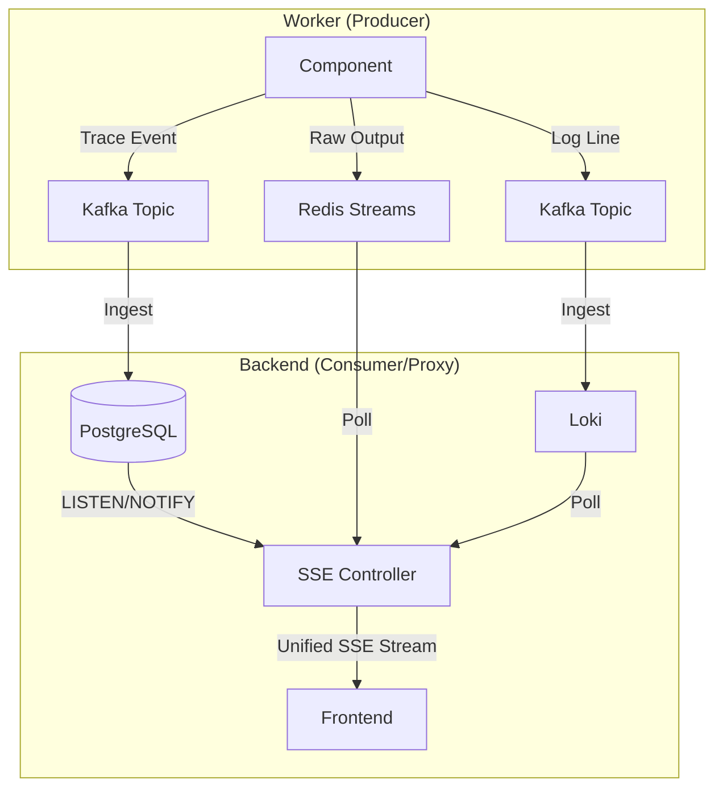

# Streaming Pipelines

ShipSec Studio handles three distinct types of real-time data, each optimized for its specific use case.

## 1. Terminal Streaming (Redis Streams)
**Purpose:** Delivers raw PTY (pseudo-terminal) output from Docker containers to the frontend with sub-50ms latency.

- **Storage:** Redis Streams (`XADD`, `XRANGE`).
- **Key Pattern:** `terminal:{runId}:{nodeRef}:{stream}` (where stream is `stdout` or `stderr`).
- **Transport:** Server-Sent Events (SSE).
- **Frontend:** [xterm.js](https://xtermjs.org/) renders the ANSI escape sequences in real-time.
- **Why Redis?** Extreme low-latency and built-in "cursor" support (stream IDs) allow the frontend to catch up if disconnected.

## 2. Event Streaming (Postgres LISTEN/NOTIFY + SSE)
**Purpose:** Updates the visual workflow timeline and node statuses (Pending → Running → Completed).

- **Storage:** PostgreSQL.
- **Trigger:** `LISTEN/NOTIFY` (via Postgres triggers on `trace_events`).
- **Events:** `STARTED`, `PROGRESS`, `COMPLETED`, `FAILED`, `AWAITING_INPUT`.
- **Transport:** Server-Sent Events (SSE).
- **Why Postgres?** Simplifies the stack by using the primary database for both persistence and real-time signaling for essential workflow events.

## 3. Log Streaming (Kafka + Loki + SSE)
**Purpose:** Providing searchable, structured logs from both the platform components and the tools.

- **Ingestion:** Kafka (as a reliable buffer).
- **Aggregation:** [Grafana Loki](https://grafana.com/oss/loki/).
- **Transport:** Server-Sent Events (SSE) — the backend SSE loop periodically polls Loki for new lines.
- **Why Loki?** Optimized for multi-tenant log storage with high compression and nanosecond precision.

---

## Technical Flow

